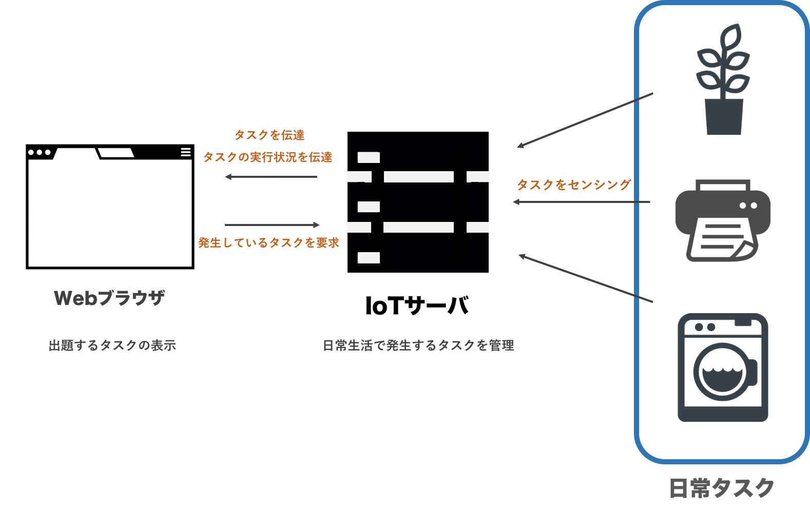

# 序論
## 背景
### チューリングテスト
### IoTの普及
## 目的
## 本論文の構成
# 研究領域の背景
## 問題提起
## 関連研究
# Physical Certification
## 概要
## 目的
## 特徴
## 提案システムの利用例
## 手法
### システム構成
 本システムは出題するタスクを表示する「Webブラウザ」,日常生活で発生するタスクを記録, Webブラウザに対してタスクの内容を送信する「IoTサーバ」, 日常タスクを感知しIoTサーバに送信する「センサ群」の3つのシステムで構成されている.

### Webブラウザ
 Webブラウザの主な役割はユーザに対してタスクを表示し遂行を促すことと, 完了の通知を受取り, ユーザのWebサービスの利用を許可することである. ユーザがWebサービス利用でチューリングテストを行うとWebブラウザからIoTサーバに対して発生しているタスクを要求する. WebブラウザはIoTサーバからタスクを受け取るとタスクの詳細をユーザに表示し, タスクの遂行を促す.
 タスクの完了の通知をIoTサーバから受け取ることでユーザにWebサービスの利用を許可する. IoTサーバの主な役割はセンサー群から日常生活のタスクの発生や完了状況をデータベースに記録とWebブラウザに対して遂行させるタスクとタスク完了の伝達である.

### IoTサーバ
 IoTサーバの主な役割はセンサー群から日常生活のタスクの発生や完了状況をデータベースに記録とWebブラウザに対して遂行させるタスクとタスク完了の伝達である. Webブラウザからの出題するタスクの要求を受け取ると, IoTサーバは完了されていないタスクからランダムで一つ選定してWebブラウザに伝達, 同時に遂行タスクを要求されたWebブラウザにタスクの実行状況を伝達する. また, IoTサーバはチューリングテストを行う以外でも常にセンサ群からタスクの発生,
 完了状況を受け取りデータベースに記録している.

### センサ群
 センサ群の役割は日常生活で発生するタスクの発生, 完了状況をセンシングしIoTサーバに対して送信することである.

### 実装
 Webブラウザ - IoTサーバ間とIoTサーバ - センサ群間の通信はWebSocketを用いて行う. またセンサ群のAPIを整形し, IoTサーバに送信するためのミドルウェアをNodeJSを用いて実装を行った.

# 実験
## 本システムがチューリングテストとして利用できるのかの検証
### 実験手法
### 結果
### 考察
## 遂行を要求されるタスクの許容量の調査
### 実験手法
### 結果
### 考察
# 参考文献
